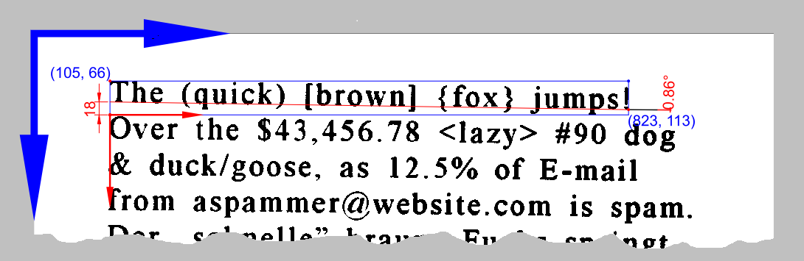
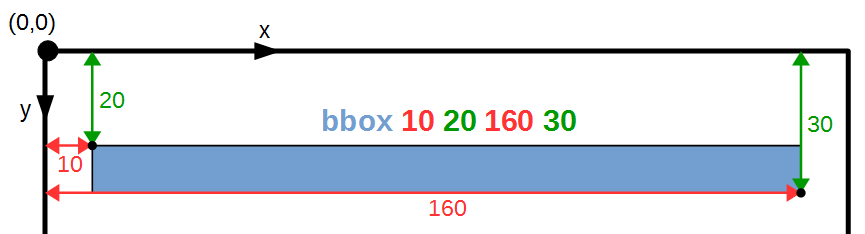

Introduction {#introduction}
============

The purpose of this document is to define an open standard for representing
document layout analysis and OCR results as a subset of HTML. The goal is to
reuse as much existing technology as possible, and to arrive at a representation
that makes it easy to store, share, process and display OCR results.

This specification defines many [features](#terminology) that can represent a
variety of OCR-related information. However, being built on top of HTML, hOCR is
designed to make it easy to start simple and gradually use more complex
constructs when necessary.

Consider you have an HTML document that encodes a book: Wrapping page elements
in <code>&lt;div class="<a href="#elementdef-ocr_page">ocr_page</a>"&gt;</code>
tags will convey the page boundaries to hOCR-capable agents and turn the HTML
document into an hOCR document.

Terminology and Representation {#terminology}
==============================

Reusing HTML {#representation}
------------

This document describes a representation of various aspects of OCR output in an
XML-like format. That is, we define as set of tags containing text and other
tags, together with attributes of those tags. However, since the content we are
representing is formatted text,

However, we are not actually using a new XML for the representation; instead
embed the representation in XHTML (or HTML) because  [[XHTML1]] and XHTML processing
already define many aspects of OCR output representation that would otherwise
need additional, separate and ad-hoc definitions. These aspects include:

  * standard representations for common logical structuring elements, including
    section headings, citations, tables, emphasis, line breaks, quotations,
    citations, and preformatted text
  * standard representations for fonts, embedded images, embedded vector
    graphics, tables, languages, writing direction, colors
  * standard representations for geometric layout and positioning
  * output files that are understood without any further modification by widely
    used viewers (browsers), editors, conversion tools, and indexing tools
  * libraries for parsing and generating the content
  * support for document metadata

We are embedding this information inside HTML by encoding it within valid tags
and attributes inside HTML. We are going to use the terms <a>elements</a> and
<a>properties</a> for referring to embedded markup.

Definition of "element" {#definition-element}
-----------------------

An hOCR element (in the following: <dfn>element</dfn>) is any HTML tag with a
<{*/class}> attribute that contains exactly one class name that starts with
`ocr_` or `ocrx_`. Non-OCR related HTML content must not use class names that
begin with `ocr_` or `ocrx_`.

Note: When referring to an HTML tag with class `ocr_page`, this spec uses the
notation <{ocr_page}>

If an HTML tag is an <a lt="element">hOCR element</a>, then its <{*/title}>
attribute must not be used for any other purpose than to define <a
lt="property">hOCR properties</a> and adhere to the <a>properties format</a>.

For some elements, the specs <dfn lt="Recommended HTML Tag">recommends using
specific HTML tags</dfn>. This is entirely optional, it may not be possible or
desirable to actually choose those tags (e.g., when adding hOCR information to
an existing HTML output routine).

Definition of "property" {#definition-property}
------------------------

<dfn lt="properties">hOCR Properties</dfn> are a set of key-value pairs that convey OCR-specific
information related to specific <a>elements</a>. They are serialized using a
<a lt="properties format">specific format</a> in the <{*/title}> attribute of
the <a>element</a> they refer to.

Note: When referring to a property `bbox`, this spec uses the notation 'bbox'.

The <dfn lt="Property Name">name of a property</dfn> must only consist of
lowercase letters and numbers. Property names must be either from those defined
in [[#hocr-props]] or begin with `x_` to denote implementation-specific
extensions.

There are four levels of association between any <a>element</a> to any
<a>property</a>:

  : <dfn>Disallowed Property</dfn>
  :: The element MUST NOT contain the property
  :: Unless defined otherwise, all properties are disallowed for any element.
  : <dfn>Required Property</dfn>
  :: The element MUST contain the property
  : <dfn>Recommended Property</dfn>
  :: The element SHOULD contain the property
  : <dfn>Allowed Property</dfn>
  :: The element MAY contain the property

A property present on an element can have on of the following relations to any
other property:

  : <dfn>Independent Property</dfn>
  :: The presence of property A has no influence on the presence of property B
  :: Unless otherwise defiined, properties are always independent
  : <dfn>Implied Property</dfn>
  :: If property A is present, property B must also be present
  : <dfn>Conflicting Property</dfn>
  :: If property A is present, property B must not be present

Properties may define a <dfn>default value</dfn>. For those elements for which the
property is not <a lt="Disallowed Properties">disallowed</a> but not explicitly
specified, the property is assigned to the element with the default value.

Properties Grammar {#grammar}
------------------

The <dfn lt="Properties Format">properties format</dfn> for the properties is as
follows, expressed in ABNF notation of [[RFC5234]]:

<pre data-dfn-type="grammar" data-link-type="grammar">
  <dfn>digit</dfn>            = %x30-39
  <dfn>uint</dfn>             = +<a>digit</a>
  <dfn>int</dfn>              = *1"-" <a>uint</a>
  <dfn>nint</dfn>             = "-" <a>uint</a>
  <dfn>fraction</dfn>         = "." <a>uint</a>
  <dfn>float</dfn>            = *<a>uint</a> <a>fraction</a>

  <dfn>whitespace</dfn>       = +%20  ; one or more spaces ' '
  <dfn>comma</dfn>            = %2C   ; comma ','
  <dfn>semicolon</dfn>        = %3B   ; semicolon ';'
  <dfn>doublequote</dfn>      = %22  ; double quote '"'
  <dfn>lowercase-letter</dfn> = %x41-5A
  <dfn>alnum-word</dfn>       = +(<a>lowercase-letter</a> / <a>digit</a>)
  <dfn>ascii-word</dfn>       = +(%x21-7E - <a>semicolon</a>)  ; printable w/o space/semicolon
  <dfn>ascii-string</dfn>     = +(%x01-FF - <a>semicolon</a>)  ; printable ascii without semicolon
  <dfn>delimited-string</dfn> = <a>doublequote</a> <a>ascii-string</a> <a>doublequote</a>

  <dfn>properties-format</dfn> = <a>key-value-pair</a> *(<a>whitespace</a> <a>semicolon</a> <a>key-value-pair</a>)
  <dfn>spec-property-name</dfn> = ("<a href="#propdef-bbox">bbox</a>" / "<a href="#propdef-baseline">baseline</a>" / "<a href="#propdef-cflow">cflow</a>" / "<a href="#propdef-cuts">cuts</a>" / "<a href="#propdef-hardbreak">hardbreak</a>" /
                        "<a href="#propdef-image">image</a>" / "<a href="#propdef-imagemd5">imagemd5</a>" / "<a href="#propdef-lpageno">lpageno</a>" / "<a href="#propdef-nlp">nlp</a>" / "<a href="#propdef-order">order</a>" /
                        "<a href="#propdef-poly">poly</a>" / "<a href="#propdef-ppageno">ppageno</a>" / "<a href="#propdef-scan_res">scan_res</a>" / "<a href="#propdef-textangle">textangle</a>")
  <dfn>engine-property-name</dfn> = "x_" <a>alnum-word</a>
  <dfn>key-value-pair</dfn> = <a>property-name</a> <a>whitespace</a> <a>property-value</a>
  <dfn>property-name</dfn> = <a>spec-property-name</a> / <a>engine-property-name</a>
  <dfn>property-value</dfn> = <a>ascii-word</a> *(<a>whitespace</a> <a>ascii-word</a>)
</pre>

This is just the general grammar, the individual <a>properties</a> will define
the exact <dfn>property grammar</dfn> that overrides <a
grammar>property-name</a> and <a grammar>property-value</a>.

<div class="example">
```html
<div class="ocr_page" id="page_1">
  <div class="ocr_carea" id="column_2" title="bbox 313 324 733 1922">
    <div class="ocr_par" id="par_7"> ... </div>
    <div class="ocr_par" id="par_19"> ... </div>
  </div>
</div>
```
</div>

The properties of hOCR {#hocr-props}
======================

The <a>properties</a> in hOCR can be broadly <dfn lt="Property
Categories">categorized</dfn> as follows:

  : <dfn>General Properties</dfn>
  :: These properties can apply to most elements

  : <dfn>Non-Recommended Properties</dfn>
  :: These properties can apply to most elements but should not be used unless
    there is no alternative:

  : <dfn>Inline Properties</dfn>
  :: These properties apply to content on or below the level of <{ocr_line}> /
    <{ocrx_line}>

  : <dfn>Layout Properties</dfn>
  :: These properties relate to placement of <a>elements</a> on the page

  : <dfn>Character Properties</dfn>
  :: These properties convey character level information

  : <dfn>Page Properties</dfn>
  :: These properties convey information on the whole page

  : <dfn>Content Flow Properties</dfn>
  :: These properties are related to the reading order and flow of content on the page

  : <dfn>Confidence Properties</dfn>
  :: These properties are related to the confidence of the hOCR producer that
    the text in the 'element' has been correctly recognized

The <dfn property>baseline</dfn> property {#baseline}
-----------------------------------------

<pre class="include">path: 1.2/include/defs/baseline</pre>

This property applies primarily to textlines.

The baseline is described by a polynomial of order `n` with the coefficients
`pn ...  p0` with `n = 1` for a linear (i.e. straight) line.

The polynomial is in the coordinate system of the line, with the bottom left of
the bounding box as the origin.

<div class="example">

The hOCR output for the first line of
[eurotext.tif](https://github.com/tesseract-ocr/tesseract/blob/master/testing/eurotext.tif)
contains the following information:

```html
<span class='ocr_line' id='line_1_1'
    title="bbox 105 66 823 113; baseline 0.015 -18">...</span>
```

'bbox' is the bounding box of the line in image coordinates (blue). The two
numbers for the baseline are the slope (1st number) and constant term (2nd
number) of a linear equation describing the baseline relative to the bottom
left corner of the bounding box (red). The baseline crosses the y-axis at `-18`
and its slope angle is `arctan(0.015) = 0.86°`.

<figure>
</figure>

</div>


The <dfn property>bbox</dfn> property {#bbox}
-------------------------------------

<pre class="include">path: 1.2/include/defs/bbox</pre>

The 'bbox' - short for "bounding box" - of an element is a rectangular box
around this element, which is defined by the upper-left corner (x0, y0) and
the lower-right corner (x1, y1).

  * the values are with reference to the the top-left corner of the document image
    and measured in pixels
  * the order of the values are `x0 y0 x1 y1` = "left top right bottom"
  * use 'x_bboxes' below for character bounding boxes
  * do not use 'bbox' unless the bounding box of the layout component is, in
    fact, rectangular
  * some non-rectangular layout components may have rectangular bounding boxes
    if the non-rectangularity is caused by floating elements around which text flows

<div class="example">

```html
<span class='ocr_line' id='line_1'
    title="bbox 10 20 160 30">...</span>
```

The bounding box 'bbox' of this line is shown in blue and it is span
by the upper-left corner (10, 20) and the lower-right corner (160, 30).
All coordinates are measured with reference to the top-left corner of
the document image which border is drawn in black.

<figure>
</figure>

</div>

The <dfn property>cflow</dfn> property {#cflow}
--------------------------------------

<pre class="include">path: 1.2/include/defs/cflow</pre>

This property relates the flow between multiple <{ocr_carea}> elements,
and between <{ocr_carea}> and <{ocr_linear}> elements.

The content flow on the page that this element is a part of

  * s must be a unique string for each content flow
  * must be present on <{ocr_carea}> and <{ocrx_block}> tags when reading
    order is attempted and multiple content flows are present
  * presence must be declared in the document meta data


The <dfn property>cuts</dfn> and <dfn property>nlp</dfn> properties {#cuts-nlp}
-------------------------------------------------------------------

<pre class="include">path: 1.2/include/defs/cuts</pre>

<ul>

  * character segmentation cuts (see below)
  * there must be a 'bbox' property relative to which the 'cuts' can be interpreted

</ul>

<pre class="include">path: 1.2/include/defs/nlp</pre>

  * estimate of the negative log probabilities of each character by the recognizer

For left-to-write writing directions, cuts are sequences of deltas in the x and
y direction; the first delta in each path is an offset in the x direction
relative to the last x position of the previous path. The subsequent deltas
alternate between up and right moves.

<div class="example">

Assume a bounding box of `(0,0,300,100)`; then

```python
cuts("10 11 7 19") =
    [ [(10,0),(10,100)], [(21,0),(21,100)], [(28,0),(28,100)], [(47,0),(47,100)] ]
cuts("10,50,3 11,30,-3") =
    [ [(10,0),(10,50),(13,50),(13,100)], [(21,0),(21,30),(18,30),(18,100)] ]
```

```html
<span class="ocr_cinfo" title="bbox 0 0 300 100; nlp 1.7 2.3 3.9 2.7; cuts 9 11 7,8,-2 15 3">hello</span>
```
</div>


Cuts are between all codepoints contained within the element, including any
whitespace and control characters.  Simply use a delta of 0 (zero) for
invisible codepoints.

Writing directions other than left-to-right specify cuts as if the bounding box
for the element had been rotated by a multiple of 90 degrees such that the
writing direction is left to right, then rotated back.

It is undefined what happens when cut paths intersect, with the exception that
a delta of 0 always corresponds to an invisible codepoint.

The <dfn property>hardbreak</dfn> property {#hardbreak}
------------------------------------------

<pre class="include">path: 1.2/include/defs/hardbreak</pre>

  * a zero (default) indicates that the end of the line is not a hard
    (explicit) line break, but a break due to text flow
  * a one indicates that the line is a hard (explicit) line break

Any special characters representing the desired end-of-line processing must be
present inside the <{ocr_line}> element. Examples of such special characters are a
soft hyphen ("­", `U+00AD`), a hard line break (`<br>`), or whitespace (` `) for soft
line breaks.

The <dfn property>image</dfn> and <dfn property>imagemd5</dfn> properties {#image}
-------------------------------------------------------------------------

<pre class="include">path: 1.2/include/defs/image</pre>

<ul>

  * image file name used as input
  * syntactically, must be a UNIX-like pathname or http URL (no Windows pathnames)
  * may be relative
  * cannot be resolved to the actual file in general (e.g., if the hOCR file
    becomes separated from the image file)
  * if the hOCR file is present in a directory hierarchy or file archive, should
    resolve to the corresponding image file

</ul>

<pre class="include">path: 1.2/include/defs/imagemd5</pre>

  * MD5 fingerprint of the image file that this page was derived from
  * allows re-associating pages with source images

The <dfn property>lpageno</dfn> and <dfn property>ppageno</dfn> property {#pageno}
------------------------------------------------------------------------

<pre class="include">path: 1.2/include/defs/lpageno</pre>

<ul>
  * the logical page number expressed on the page
  * may not be numerical (e.g., Roman numerals)
  * usually is unique
  * must not be present unless it has been recognized from the page and is unambiguous

</ul>

<pre class="include">path: 1.2/include/defs/ppageno</pre>

  * the physical page number
  * the front cover is page number 0
  * should be unique
  * must not be present unless the pages in the document have a physical ordering
  * must not be present unless it is well defined and unique

The <dfn property>order</dfn> property {#order}
--------------------------------------

<pre class="include">path: 1.2/include/defs/order</pre>

The reading order of the element (an integer)

  * this property must not be used unless there is no other way of representing
    the reading order of the page by element ordering within the page, since
    many tools will not be able to deal with content that is not in reading order
  * presence must be declared in the document meta data

The <dfn property>poly</dfn> property {#poly}
-------------------------------------

<pre class="include">path: 1.2/include/defs/poly</pre>

A closed polygon for elements with non-rectangular bounds

  * this property must not be used unless there is no other way of
    representing the layout of the page using rectangular bounding boxes,
    since most tools will simply not have the capability of dealing with
    non-rectangular layouts
  * note that the natural and correct representation of many non-rectangular
    layouts is in terms of rectangular content areas and rectangular floats
  * documents using polygonal borders anywhere must indicate this by adding
    ''ocr-capabilities/ocrp_poly'' to the list of 'ocr-capabilities' (see
    [[#capabilities]])
  * documents should attempt to provide a reasonable 'bbox' equivalent as well


Logical Structuring Elements {#logical-elements}
============================

Issue: [Logical Tags/classes](https://github.com/kba/hocr-spec/issues/66)

The classes defined in this section for logically structuring a hOCR document
have their standard meaning as used in the publishing industry and tools like
LaTeX, MS Word, and others.

  : <dfn element>ocr_document</dfn>
  :: Recommended HTML Tag: <{div}>

  : <dfn element>ocr_title</dfn>
  :: Recommended HTML Tag: <a element>h1</a>

  : <dfn element>ocr_author</dfn>

  : <dfn element>ocr_abstract</dfn>

  : <dfn element>ocr_part</dfn>
  :: Recommended HTML Tag: <{h1}>

  : <dfn element>ocr_chapter</dfn>
  :: Recommended HTML Tag: <{h1}>

  : <dfn element>ocr_section</dfn>
  :: Recommended HTML Tag: <{h2}>

  : <dfn element>ocr_subsection</dfn>
  :: Recommended HTML Tag: <{h3}>

  : <dfn element>ocr_subsubsection</dfn>
  :: Recommended HTML Tag: <{h4}>

  : <dfn element>ocr_display</dfn>

  : <dfn element>ocr_blockquote</dfn>
  :: Recommended HTML Tag: <{blockquote}>

  : <dfn element>ocr_par</dfn>
  :: Recommended HTML Tag: <{p}>

  : <dfn element>ocr_linear</dfn>

  : <dfn element>ocr_caption</dfn>
  :: Image captions may be indicated using the <{ocr_caption}> element; such an
    element refers to the image(s) contained within the same float, or the
    immediately adjacent image if both the image and the <{ocr_caption}> element
    are in running text.

Tags must be nested as indicated by the following list, but not all tags within the
hierarchy need to be present.

	* <{ocr_document}>
		* <{ocr_linear}>
			* <{ocr_title}>
			* <{ocr_author}>
			* <{ocr_abstract}>
			* <{ocr_part}>
				* <{ocr_chapter}>
					* <{ocr_section}> ▻ <{ocr_subsection}> ▻ <{ocr_subsubsection}>
						* <{ocr_display}>
						* <{ocr_blockquote}>
						* <{ocr_par}>

For all of these elements except <{ocr_linear}>, there exists a natural linear
ordering defined by reading order (<{ocr_linear}> indicates that the elements
contained in it have a linear ordering). At the level of <{ocr_linear}>, there
may not be a single distinguished order. A common example of <{ocr_linear}> is a
newspaper, in which a single newspaper may contain many linear, but there is no
unique reading order for the different linear. OCR evaluation tools should
therefore be sensitive to the order of all elements other than <{ocr_linear}>.

Textual information like section numbers and bullets must be represented as
text inside the containing element.

Documents whose logical structure does not map naturally onto these logical
structuring elements must not use them for other purposes.


Typesetting Related Elements {#typesetting-elements}
============================

The following typesetting related elements are based on a typesetting model as
found in most typesetting systems, including
[XSL:FO](https://www.w3.org/TR/xsl11/#fo-section),
[(La)TeX](https://latex-project.org/guides/usrguide.pdf),
[LibreOffice](https://wiki.documentfoundation.org/images/e/e6/WG42-WriterGuideLO.pdf),
and Microsoft Word.

In those systems, each page is divided into a number of areas. Each area can
either be a part of the body text (or multiple body texts, in the case of
newspaper layouts). The content of the areas derives from a linear stream of
textual content, which flows into the areas, filling them linewise in their
preferred directions.

Overlayed onto the page is a set of floating elements; floating elements exist
outside the normal reading order. Floating elements may be introduced by the
textual content, or they may be related to the page itself (anchoring is a
logical property). In typesetting systems, floating elements may be anchored to
the page, to paragraphs, or to the content stream. Floating elements can
overlap content areas and render on top of or under content, or they can force
content to flow around them. The default for floating elements in this spec is
that their anchor is undefined (it is a logical property, not a typesetting
property), and that text flows around them. Note that with rectangular content
areas and rectangular floats, already a wide variety of non-rectangular text
shapes can be realized.

Issue: There is currently no way of indicating anchoring or flow-around
properties for floating elements; properties need to be defined for this.

Classes for typesetting elements {#typesetting-classes}
--------------------------------

The following classes, as well as [floats](#classes-for-floats) are used for type-setting
elements.

### <dfn element>ocr_page</dfn>

The <{ocr_page}> element must be present in all hOCR documents.

### <dfn element>ocr_column</dfn>

<div class="annoying-warning">
**OBSOLETE**

Please use <{ocr_carea}> instead
</div>

### <dfn element>ocr_carea</dfn>

"ocr content area" or "body area"

Used to be called <del>ocr_column</del>

The <{ocr_carea}> elements should appear in reading order unless this is impossible
because of some other structuring requirement. If the document contains multiple
<{ocr_linear}> streams, then each <{ocr_carea}> must indicate which stream it belongs
to.

Note that for many documents, the actual ground truth careas are well-defined
by the document style of the original document before printing and scanning.
From a single page, the `careas` of the original document style cannot be
recovered exactly. However, the partition of a document by <{ocr_carea}> for an
individual page shall be considered correct relative to ground truth if

  1. all the text contained in a ground truth carea is fully contained within a
    single <{ocr_carea}>,
  2. no text outside a ground truth `carea` is contained within an
    <{ocr_carea}>, and 
  3. the <{ocr_carea}> appear in the same order as the text flow
    relationships between the ground truth careas.

### <dfn element>ocr_line</dfn>

In typesetting systems, content areas are filled with “blocks”, but most of
those blocks are not recoverable or semantically meaningful. However, one type
of block is visible and very important for OCR engines: the line. Lines are
typesetting blocks that only contain glyphs (“inlines” in XSL terminology).
They are represented by the <{ocr_line}> area.

<{ocr_line}> should be in a `<span>`

### <dfn element>ocr_separator</dfn>

Any separator or similar element

### <dfn element>ocr_noise</dfn>

Any noise element that isn't part of typesetting

## Recommended Properties for typesetting elements

The following properties should be present:


## Optional Properties for typesetting elements

The following properties MAY be present:

### <dfn property>scan_res</dfn>

`scan_res x_res y_res`

  * scanning resolution in DPI

### <dfn property>x_scanner</dfn>

`x_scanner string`

  * a representation of the scanner

### <dfn property>x_source</dfn>

`x_source string`

  * an implementation-dependent representation of the document source
  * could be a URL or a /gfs/ path
  * offsets within a multipage format (e.g., TIFF) may be represented using
    additional strings or using URL parameters or fragments
  * examples
    * `x_source /gfs/cc/clean/012345678911 17`
    * `x_source http://pageserver/012345678911&page=17`

In addition to the standard
properties, the <{ocr_line}> area supports the following additional properties:

## Classes for floats

Floats should not be nested.

The following floats are defined:

### <dfn element>ocr_float</dfn>

`ocr_float`

### <dfn element>ocr_separator</dfn>

`ocr_separator` in the context of float classes.

### <dfn element>ocr_textfloat</dfn>

`ocr_textfloat`

### <dfn element>ocr_textimage</dfn>

`ocr_textimage`

### <dfn element>ocr_image</dfn>

`ocr_image`

### <dfn element>ocr_linedrawing</dfn>

Something that could be represented well and naturally in a vector graphics
format like SVG (even if it is actually represented as PNG)

### <dfn element>ocr_photo</dfn>

Something that requires JPEG or PNG to be represented well

### <dfn element>ocr_header</dfn>

`ocr_header`

### <dfn element>ocr_footer</dfn>

`ocr_footer`

### <dfn element>ocr_pageno</dfn>

`ocr_pageno`

### <dfn element>ocr_table</dfn>

`ocr_table`

Inline Representations {#inline-representation}
======================

Issue(51):

There is some content that should behave and flow like text

Unrecognized characters and words {#unrecognized}
---------------------------------

  : <dfn element>ocr_glyph</dfn>
  :: An individual glyph represented as an image (e.g., an unrecognized character)
  :: Must contain a single <{img}> tag, or be present on one

  : <dfn element>ocr_glyphs</dfn>
  :: Multiple glyphs represented as an image (e.g., an unrecognized word)
  :: Must contain a single <{img}> tag, or be present on one

Dropcap {#dropcap}
-------

  : <dfn element>ocr_dropcap</dfn>
  :: An individual glyph representing a dropcap
  :: May contain text or an <{img}> tag; the `alt=` of the image tag should contain
    the corresponding text

Mathematical and chemical formulas {#formulas}
----------------------------------

Mathematical and chemical formulas that float must be put into an <{ocr_float}>
section.

Mathematical and chemical formulas that are “display” mode should be put into
an <{ocr_display}> section.

: <dfn element>ocr_chem</dfn>
:: A chemical formula
:: Must contain either a single <{img}> tag or [[CML]] markup, or be present on one

: <dfn element>ocr_math</dfn>
:: A mathematical formula
:: Must contain either a single <{img}> tag or [[MathML]] markup, or be present on one

Superscript and Subscript {#sub-sup}
-------------------------

Superscripts and subscripts, when not in <{ocr_math}> or <{ocr_chem}> formulas,
must be represented using the HTML <{sup}> and <{sub}> tags, even if special
Unicode characters are available.

Whitespace {#whitespace}
----------

Non-breaking spaces must be represented using the HTML `&nbsp;` entity.

Different space widths should be indicated using HTML and `&ensp;`, `&emsp;`,
`&thinsp;`, `&zwnj;`, `&zwj;`.

Hyphenation {#hyphenation}
-----------

Issue(7): How to handle hyphens?

Issue(altoxml/schema#41): Non Linear Hyphens

Soft hyphens must be represented using the HTML `&shy;` entity.

Ruby characters {#ruby}
---------------

[Furigana and similar constructs](https://en.wikipedia.org/wiki/Ruby_character)
must be represented using their correct Unicode encoding.


Character Information {#character-information}
=====================

Classes for Character Information {#character-classes}
---------------------------------

Character-level information may be put on any element that contains only a
single "line" of text.

### <dfn element>ocr_cinfo</dfn>

Issue: ocrx_cinfo?

  * If no other layout element applies, the <{ocr_cinfo}> element may be used.
  * <{ocrx_cinfo}> should nest inside <{ocrx_line}>
  * <{ocrx_cinfo}> should contain only 'x_confs', 'x_bboxes', and 'cuts' attributes

## Properties for Character Information


OCR Engine-Specific Markup {#engine-markup}
==========================

A few abstractions are used as intermediate abstractions in OCR engines,
although they do not have a meaning that can be defined either in terms of
typesetting or logical function. Representing them may be useful to represent
existing OCR output, say for workflow abstractions.

Common suggested engine-specific markup are:

Classes for engine specific markup {#engine-classes}
----------------------------------

### <dfn element>ocrx_block</dfn>

Issue: [ocr_carea vs ocrx_block](https://github.com/kba/hocr-spec/issues/28)

  * any kind of "block" returned by an OCR system
  * engine-specific because the definition of a "block" depends on the engine

Generators should attempt to ensure the following properties:

  * An <{ocrx_block}> should not contain content from multiple <{ocr_carea}>.
  * The union of all <{ocrx_block|ocrx_blocks}> should approximately cover all <{ocr_carea}>.
  * an <{ocrx_block}> should contain either a float or body text, but not both
  * an <{ocrx_block}> should contain either an image or text, but not both

### <dfn element>ocrx_line</dfn>

Issue: [ocr_line vs ocrx_line](https://github.com/kba/hocr-spec/issues/19)

  * any kind of "line" returned by an OCR system that differs from the standard <{ocr_line}> above
  * might be some kind of "logical" line
  * an <{ocrx_line}> should correspond as closely as possible to an <{ocr_line}>

### <dfn element>ocrx_word</dfn>

  * any kind of "word" returned by an OCR system
  * engine specific because the definition of a "word" depends on the engine

## Properties for engine-specific markup

The following properties are defined:

### <dfn property>x_font</dfn>

`x_font s`

  * OCR-engine specific font names

### <dfn property>x_fsize</dfn>

`x_fsize n`

  * OCR-engine specific font size

### <dfn property>x_bboxes</dfn>

`x_bboxes b1x0 b1y0 b1x1 b1y1 b2x0 b2y0 b2x1 b2y1 ...`

  * OCR-engine specific boxes associated with each codepoint contained in the
    element
  * note that the 'bbox' property is a property for the bounding box of a layout
    element, not of individual characters
  * in particular, use `<span class="ocr_cinfo" title="x_bboxes ....">`, not
    `<span class="ocr_cinfo" title="bbox ...">`

### <dfn property>x_confs</dfn>

`x_confs c1 c2 c3 ...`

  * OCR-engine specific character confidences
  * `c1` etc. must be numbers
  * higher values should express higher confidences
  * if possible, convert character confidences to values between 0 and 100 and
    have them approximate posterior probabilities (expressed in %)

### <dfn property>x_wconf</dfn>

`x_wconf n`

  * OCR-engine specific confidence for the entire contained substring
  * n must be a number
  * higher values should express higher confidences
  * if possible, convert word confidences to values between 0 and 100 and have
    them approximate posterior probabilities (expressed in %)

Font, Text Color, Language, Direction {#font-lang}
=====================================

OCR-generated font and text color information is encoded using standard HTML
and CSS attributes on elements with a class of `ocr_...` or `ocrx_...`.

Language and writing direction should be indicated using the HTML standard
attributes <{*/lang}> and <{*/dir}>.

The HTML <a href="https://www.w3.org/TR/REC-html40/struct/dirlang.html#h-8.2.5">`&lrm;` and
`&rlm;` entities</a> (indicating writing direction) must not be used; all
writing direction changes must be indicated with new tags with an appropriate
<{*/dir}> attribute.

OCR information and presentation information can be separated by putting the
CSS info related to the CSS in an outer element with an `ocr_` or `ocrx_` class,
and then overriding it for the presentation by nesting another `<span>` with the
actual presentation information inside that:

```
<span class="ocr_cinfo" style="ocr style"><span style="presentation style"> ... </span></span>
```

The CSS3 text layout attributes can be used when necessary. For example, CSS
supports writing-mode, direction, glyph-orientation [[ISO15924]]-based
script ([list of codes](http://www.unicode.org/iso15924/codelists.html)), text-indent, etc.


Alternative Segmentations / Readings {#segmentation}
====================================

Issue: [Delete x_cost](https://github.com/kba/hocr-spec/issues/9)

Alternative segmentations and readings are indicated by a `<span>` with
`class="alternatives"`. It must contains `<ins>` and `<del>` elements. The first
contained element should be `<ins>` and represent the most probable interpretation,
the subsequent ones `<del>`. Each `<ins>` and `<del>` element should have `class="alt"` and a
property of either 'nlp' or 'x_cost'. These `<span>`, `<ins>`, and `<del>` tags can nest
arbitrarily.

<div class="example">
```html
<span class="alternatives">
<ins class="alt" title="nlp 0.3">hello</ins>
<del class="alt" title="nlp 1.1">hallo</del>
</span>
```
</div>

Whitespace within the `<span>` but outside the contained `<ins>`/`<del>`
elements is ignored and should be inserted to improve readability of the HTML
when viewed in a browser.


Grouped Elements and Multiple Hierarchies {#groups}
=========================================

The different levels of layout information (logical, physical, engine-specific)
each form hierarchies, but those hierarchies may not be mutually compatible;
for example, a single <{ocr_page}> may contain information from multiple sections
or chapters. To represent both hierarchies within a single document, elements
may be grouped together.  That is, two elements with the same class may be
treated as one element by adding a "groupid identifier" property to them and
using the same identifier. 

Grouped elements should be logically consistent with the markup they represent;
for example, it is probably not sensible to use grouped elements to interleave
parts of two different chapters.  Therefore, grouped elements should usually be
adjacent in the markup.

Applications using hOCR may choose to manipulate grouped elements directly, but
the simplest way of dealing with them is to transform a document with grouped
elements into one without grouped elements prior to further processing by first
removing tags that are not of interest for the subsequent processing step, and
then collapsing grouped elements into single elements.  For example, output
that contains both logical and physical layout information, where the logical
layout information uses grouped elements, can be transformed by removing all
the physical layout information, and then collapsing all split <{ocr_chapter}>
elements into single <{ocr_chapter}> elements based on the groupid.  The result is
a simple DOM tree.  This transformation can be provided generically as a
pre-processor or Javascript.

The presence of grouped elements does not need to be indicated in the header;
when it affects their operations, hOCR processors should check for the presence
of grouped elements in the output and fail with an error message if they cannot
correctly process the hOCR information.


Metadata {#metadata}
========

The creator of the hOCR document can indicate the following information
information using <{meta}> tags in the <{head}> section.

  : <dfn property>ocr-system</dfn>
  :: Indicates software and version that generated the hOCR document
  :: Every hOCR document *must* have exactly one 'ocr-system' metadata field

  : <dfn property>ocr-capabilities</dfn>
  :: Features consumers of the hOCR document can expect
  :: See [[#capabilities]] for possible values
  :: Every hOCR document *must* have exactly one 'ocr-capabilities' metadata field

  : <dfn property>ocr-number-of-pages</dfn>
  :: The number of <{ocr_page}> in the document

  : <dfn property>ocr-langs</dfn>
  :: Use [ISO 639-1](https://www.loc.gov/standards/iso639-2/php/code_list.php) codes
  :: Value may be `unknown`

  : <dfn property>ocr-scripts</dfn>
  :: Use [ISO 15924](http://www.unicode.org/iso15924/codelists.html) letter codes
  :: Value may be `unknown`

Capabilities {#capabilities}
------------

Any program generating files in this output format must indicate in the
document metadata what kind of markup it is capable of generating. This
includes listing the exact set of markup sections that the system could have
generated, even if it did not actually generate them for the particular
document.

If a document lists a certain capabilities but no element or attribute is found
that corresponds to that capability, users of the document may infer that the
content is absent in the source document. If a capability is not listed, the
corresponding element or attribute must not be present in the document.

The capability to generate specific properties is given by the prefix `ocrp_...`;
the important properties are:

<dl dfn-for="ocr-capabilities">

  : <dfn value>ocrp_lang</dfn>
  :: Capable of generating <{*/lang}> attributes

  : <dfn value>ocrp_dir</dfn>
  :: Capable of generating <{*/dir}> attributes

  : <dfn value>ocrp_poly</dfn>
  :: Capable of generating [polygonal bounds](#poly)

  : <dfn value>ocrp_font</dfn>
  :: Capable of generating font information (standard font information)

  : <dfn value>ocrp_nlp</dfn>
  :: Capable of generating 'nlp|nlp confidences'

  : `ocr_embeddedformat_<formatname>`
  :: The capability to generate other specific embedded formats is given by the
    prefix `ocr_embeddedformat_<formatname>`.

  : `ocr_<tag>_unordered`
  :: If an OCR engine represents a particular tag but cannot determine reading
    order for that tag, it must must specify a capability of
    `ocr_<tag>_unordered`.

</dl>


Document metadata {#document-metadata}
-----------------

For document meta information, use the [Dublin Core Embedding into
HTML](http://dublincore.org/documents/dcq-html/). See also [Citation Guidelines
for Dublin Core](http://dublincore.org/documents/dc-citation-guidelines/).


Example {#metadata-example}
-------

<div class=example>
```html
<html>
  <head>
    <meta name="ocr-system" content="tesseract v3.03"/>
    <meta name="ocr-capabilities" content="ocr_page ocr_line ocrp_lang"/>
    <meta name="ocr-langs" content="aa la zu"/>
    <meta name="ocr-scripts" content="Arab Khmr"/>
    <meta name="ocr-number-of-pages" content="112"/>
    ...
  </head>
  ...
</html>
```

Indicate that the work this hOCR file represents:

  * was produced by Tesseract v3.03
  * will provide <{ocr_page}> and <{ocr_line}> elements with <{*/lang}> attribute
  * contains text written in the Afar, Latin or Zulu languages
  * contains text written in Arabic and Khmer script
  * has `112` pages

</div>


Profiles {#profiles}
========

hOCR provides standard means of marking up information, but it does not mandate
the presence or absence of particular kinds of information.  For example, an
hOCR file may contain only logical markup, only physical markup, or only
engine-specific markup. As a result, merely knowing that OCR output is hOCR
compliant doesn't tell us whether that file is actually useful for subsequent
processing.

OCR systems can use hOCR in various different ways internally, but we will
eventually define some common profiles that mandate what kinds of information
needs to be present in particular kinds of output.

Of particular importance are:

  * physical layout profile: OCR output in XHTML format with a defined set of
    common physical layout markup capabilities (page, carea, floats, line).
    Logical layout may be present as well, but the document tree structure must
    represent the physical layout structure, with logical layout elements split
    and grouped as needed.

  * logical layout profile: OCR output in XHTML format with a defined set of
    common logical layout markup capabilities (linear, chapter, section,
    subsection).  Physical layout may be present as well, but the document tree
    structure must represent the logical layout structure, with logical layout
    elements split and grouped as needed.

Other possible profiles might be defined for specific engines or specific
document classes:

  * common commercial OCR output (e.g., Abbyy)
    * <{ocr_page}>
    * <{ocrx_block}>, <{ocrx_line}>, <{ocrx_word}>
    * ''ocr-capabilities/ocrp_lang''
    * ''ocr-capabilities/ocrp_font''
  * book target
    * all logical structuring elements (as applicable), except <{ocr_linear}>
    * <{ocr_page}>
  * newspaper target
    * all logical structuring elements (as applicable)
    * articles map on <{ocr_linear}>
    * <{ocr_page}>

HTML Markup {#html-markup}
===========

The HTML-based markup is orthogonal to the hOCR-based markup; that is, both can
be chosen independent of one another. The only thing that needs to be
consistent between the two markups is the text contained within the tags. hOCR
and other embedded format tags can be put on HTML tags, or they can be put on
their own <{div}>/<{span}> tags.

There are many different choices possible and reasonable for the HTML markup,
depending on the use and further processing of the document. Each such choice
must be indicated in the meta data for the document.

Many mappings derived from existing tools are quite similar, and most follow
the restrictions and recommendations below already without further
modifications.

Depending on the particular HTML markup used in the document, the document is
suitable for different kinds of processing and use. The formats have the
following intents:

  : <a>html_none</a> (see [[#format-none]])
  :: Straightforward equivalent of Goodoc or [[XDOC]]
  : <a>html_simple</a>
  :: Target format for convenient on-line viewing and intermediate format for indexing
  : <a>html_xytable_absolute</a>, <a>html_xytable_relative</a>
  :: Target format for layout-preserving on-screen document viewing
  : Formats defined in [[#format-ocr]]
  :: Straightforward recording of commercial OCR system output
  : Formats defined in [[#format-absolute]]
  :: Target format for services like Google's View as HTML

As long as a format contains the hOCR information, it can be reprocessed by
layout analysis software and converted into one of the other formats. In
particular, we envision layout analysis tools for converting any hOCR document
into <a>html_absolute</a>, <a>html_xytable_absolute</a>, and
<a>html_simple</a>. Furthermore, internally, a layout analysis system might
use <a>html_xytable_absolute</a> as an intermediate format for converting hOCR
into <a>html_simple</a>.


Recommendations for Mappings {#html-mappings}
----------------------------

When possible, any mapping of logical structure onto HTML should try to follow the following rules:

  * the mapping should be "natural" -- similar to what an author of the document
    might have entered into a WYSIWYG content creation tool
  * text should be in reading order
  * all tags should be used for the intended purpose (and only for the intended
    purpose) as defined in the [[HTML40]] spec.
  * floats are contained in <{div}> elements with a `style` that includes a float attribute
  * repeating floating page elements (header/footer) should be repeated and occur
    in their natural location in reading order (e.g., between pages)
  * embedded images and SVG should be contained in files in the same directory
    (no `/` in the URL) and embedded with <{img}> and <{embed}> tags, respectively

Specifically

  * <{em}> and <{strong}> should represent emphasis, and are preferred to <{b}>, <{i}>, and <{u}>
  * <{b}>, <{i}>, and <{u}> should represent a change in the corresponding
    attribute for the current font (but an OCR font specification must still be
    given)
  * <{p}> should represent paragraph breaks
  * <{br}> should represent explicit linebreaks (not linebreak that happen because of text flow)
  * <{h1}>, ..., <{h6}> should represent the logical nesting structure (if any) of the document
  * <{a}> should represent hyperlinks and references within the document
  * <{blockquote}> should represent indented quotations, but not other uses of indented text.
  * <{ul}>, <{ol}>, <{dl}> should represent lists
  * <{table}> should represent tables, including correct use of the <{th}> tag

If necessary, the markup may use the following non-standard tags:

  * <{nobr}> to indicate that line breaking is not permitted for the enclosed content
  * <{wbr}> to indicate that line breaking is permitted at that location

HTML without logical markup {#format-none}
---------------------------

The <dfn>html_none</dfn> format contains no logical markup at all; it is
simply a collection of <{div}> and <{span}> elements with associated hOCR
information. Note that such documents can still be rendered visually through
the use of CSS.

HTML with limited logical elements {#format-simple}
----------------------------------

The <dfn>html_simple</dfn> format follows the restrictions and
recommendations above, and only uses the following tags:

  * <{h1}> ...  <{h6}>
  * <{p}>, <{br}>
  * <{b}>, <{i}>, and <{u}> for appearance changes (bold, italic, underline)
  * <{font}> for any other appearance changes
  * <{a}>
  * <{div}> with a float style for floats
  * <{table}> for tables
  * <{img}> for images
  * all SVG must be externally embedded with the <{embed}> tag
  * the use of other embedded formats is permitted
  * all other uses of <{div}>, <{span}>, <{ins}>, and <{del}> only for hOCR tags or other embedded formats (hCard, …)

HTML produced by OCR engines {#format-ocr}
----------------------------

HTML markup produced by default by the OCR engine for the given document
must follow the template `html_ocr_<engine>`.

Examples of possible values are:

  : <dfn>html_ocr_unknown</dfn>
  :: The HTML was generated by some OCR engine, but it's unknown which one
  : <dfn>html_ocr_finereader_8</dfn>
  : <dfn>html_ocr_textbridge_11</dfn>

HTML with absolute positioning {#format-absolute}
------------------------------

  : <dfn>html_absolute</dfn>
  :: The HTML represents absolute positioning of elements on each page. 

Possible subformats are:

  : <dfn>html_absolute_cols</dfn>
  :: absolute positioning of cols

  : <dfn>html_absolute_pars</dfn> 
  :: absolute positioning of paragraphs

  : <dfn>html_absolute_lines</dfn> 
  :: absolute positioning of lines

  : <dfn>html_absolute_words</dfn> 
  :: absolute positioning of words

  : <dfn>html_absolute_chars</dfn> 
  :: absolute positioning of characters

The ["View as HTML" for PDF
files](https://googlewebmastercentral.blogspot.de/2011/09/pdfs-in-google-search-results.html)
feature of Google Search uses <a>html_absolute_lines</a>; this is probably the most
reasonable choice for approximating the appearance of the original document.

HTML as table {#format-table}
-------------

  : <dfn>html_xytable</dfn>
  :: The HTML is a table that gives the XY-cut layout segmentation structure of
    the page in tabular form.
  :: Note that in this format, text order does not necessarily correspond to
    reading order.
  :: The format must contain one <{table}> of class <dfn element>ocr_xycut</dfn>
    representing each page. The markup of the content of the table itself is as in
    <a>html_simple</a>.

Possible subformats are:

: <dfn>html_xytable_absolute</dfn>
:: The <{table}> structure must represent the absolute size of the original page element.

: <dfn>html_xytable_relative</dfn>
:: Table element sizes are expressed relative (percentages).

HTML from word processors {#format-wordprocessor}
-------------------------

The HTML represents markup that follows the mappings of the given document
processor to HTML.

Note that the document doesn't actually need to have been constructed in the
processor and that the processor doesn't need to have been used to generate
the HTML. For example, the <a>html_latex2html</a> tag merely indicates that,
say, a scanned and ocr'ed article uses the same conventions for logical markup
tags that an equivalent article actually written in LaTeX and actually
converted to HTML would have used.

  : <dfn>html_latex2html</dfn>

  : <dfn>html_msword</dfn>
  :: HTML mapping generated by “Save As HTML”

  : <dfn>html_ooffice</dfn>
  :: HTML mapping generated by “Save As HTML”

  : <dfn>html_docbook_xsl</dfn>
  :: HTML mapping generated by official XSL style sheets

Appendix A: Revision History {#history}
============================

hOCR has been originally developed by Thomas Breuel.

See the [releases](https://github.com/kba/hocr-spec/releases/) and full [commit
history](https://github.com/kba/hocr-spec/commits/) for a revision history.


Appendix B: Sample Usage {#sample-usage}
========================

See also the [hocr-tools](https://github.com/tmbdev/hocr-tools) for more samples.

The HTML format described here may seem fairly complicated and difficult to
parse, but because there are lots of tools for manipulating HTML documents,
they're actually pretty easy to manipulate. Here are some examples:

```python
import libxml2,re,os,string

# convert the HTML to XHTML (if necessary)
os.system("tidy -q -asxhtml < page.html > page.xhtml 2> /dev/null")

# parse the XML
doc = libxml2.parseFile('page.xhtml')

# search all nodes having a class of ocr_line
lines = doc.xpathEval("//*[@class='ocr_line']")

# a function for extracting the text from a node
def get_text(node):
    textnodes = node.xpathEval(".//text()")
    s = string.join([node.getContent() for node in textnodes])
    return re.sub(r'\s+',' ',s)

# a function for extracting the bbox property from a node
# note that the title= attribute on a node with an ocr_ class must
# conform with the OCR spec

def get_bbox(node):
    data = node.prop('title')
    bboxre = re.compile(r'\bbbox\s+(\d+)\s+(\d+)\s+(\d+)\s+(\d+)')
    return [int(x) for x in bboxre.search(data).groups()]

# this extracts all the bounding boxes and the text they contain
# it doesn't matter what other markup the line node may contain
for line in lines:
    print get_bbox(line),get_text(line)
```

Note that the OCR markup, basic HTML markup, and semantic markup can co-exist
within the same HTML file without interfering with one another.

Appendix C: IANA Considerations {#iana}
===============================

Issue: [XML namespace for hOCR HTML?](https://github.com/kba/hocr-spec/issues/2)

Issue: [What DOCTYPE for hOCR HTML?](https://github.com/kba/hocr-spec/issues/1)

Media Type {#media-type}
----------

In accordance to [[RFC2048]]

Issue: [correct MIME type for hOCR?](https://github.com/kba/hocr-spec/issues/27)

  : MIME media type name
  :: `text`
  : MIME subtype name:
  :: `vnd.hocr+html`
  : Required parameters:
  : Optional parameters:
  : Encoding considerations:
  :: hOCR documents should be encoded as UTF-8
  : Security considerations:
  : Interoperability considerations:
  : Applications which use this media type:
  : File extension(s):
  :: `*.html`, `*.hocr`


<!--
vim: tw=80 sw=2 ts=2 et
-->
